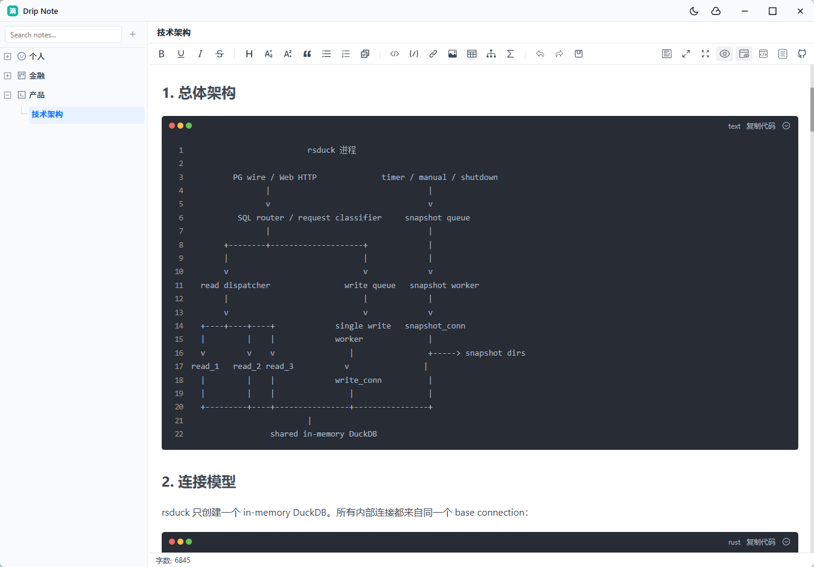

<p align="right">
  <a href="./README.md">简体中文</a> | English
</p>

# Drip Note

A local-first, lightweight notebook that is ready the moment you open it.

Drip Note is built for high-frequency everyday writing: quick thoughts, work references, technical notes, and long-form drafts should all live in a quiet, fast, and fully controlled desktop app. It is not trying to become a complex knowledge platform first. The product starts with the basics that matter most: write things down, find them again, keep them safe, and keep the experience fast.



## Product Positioning

The current version of Drip Note focuses on personal local note-taking:

- Open the app and go straight into the note list and editor.
- Keep data in the current executable directory by default, making backup and migration straightforward.
- Support two note types: plain text and Markdown.
- Organize content with a tree structure for projects, topics, and timelines.
- Use icons and tags as lightweight metadata without turning note management into a heavy workflow.

## Core Experience

### 1. Local First

Notes are stored locally in `drip-note.db`. The app does not require accounts or cloud services, making it suitable for personal references, work drafts, and offline usage.

### 2. Two Note Types

- Plain text: quick notes, sticky-note style records, lists, and temporary content.
- Markdown: technical documents, long-form writing, code snippets, and structured knowledge.

### 3. Tree-Based Note Management

The left sidebar supports nested nodes. Right-click actions include creating, renaming, moving, editing properties, and deleting. Deleting a node is blocked when it still has child nodes, reducing accidental data loss.

### 4. Auto Save

Edits go through a shared save queue. Normal typing is saved automatically, and the app also forces a save when switching notes, losing window focus, or closing the window.

### 5. Icons and Tags

Each note node can have an icon and tags. The icon picker includes a categorized icon library, making it easy to visually distinguish projects, references, tasks, technical notes, media, and other content types.

### 6. Lightweight Desktop Feel

Drip Note is built with Tauri. The window, theme, and editor layout are designed around desktop note-taking. Light and dark themes are available, and the interface stays restrained so writing and reading remain the priority.

## Who It Is For

- Developers who want a local reference notebook.
- People who want to manage work logs, project notes, and temporary thoughts in one place.
- Users who do not want their note tool tied to accounts, subscriptions, or complex cloud services.
- Markdown users who still want the speed of plain text notes.

## Current Scope

Drip Note currently prioritizes the local notebook experience. Sync, publishing, and collaboration features will be designed after the core product experience is stable, avoiding unnecessary platform complexity too early.

## Tech Stack

- Desktop shell: Tauri v2
- Frontend: Vue 3, TypeScript, Vite, Pinia
- UI: Ant Design Vue
- Editor: md-editor-v3
- Database: SQLite via the Tauri SQL plugin

## Development

```bash
pnpm install
pnpm tauri dev
```

## Build

```bash
pnpm build
pnpm tauri build
```

## Release Build

This repository includes a GitHub Actions release workflow. Pushing any Git tag triggers Tauri bundle builds and creates a draft GitHub Release:

```bash
git tag v0.1.0
git push origin v0.1.0
```

## Data File

The compiled app prefers `drip-note.db` from the same directory as the executable. To migrate data, place `drip-note.db` next to the app executable.

## License

MIT License
